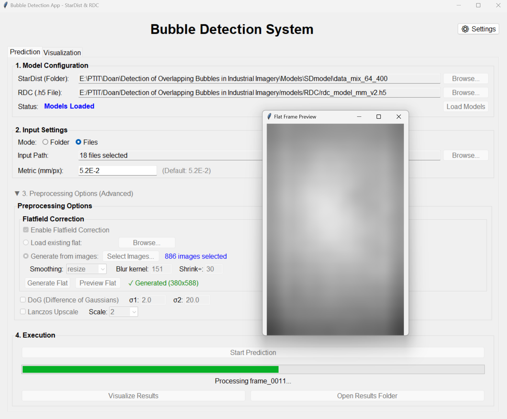
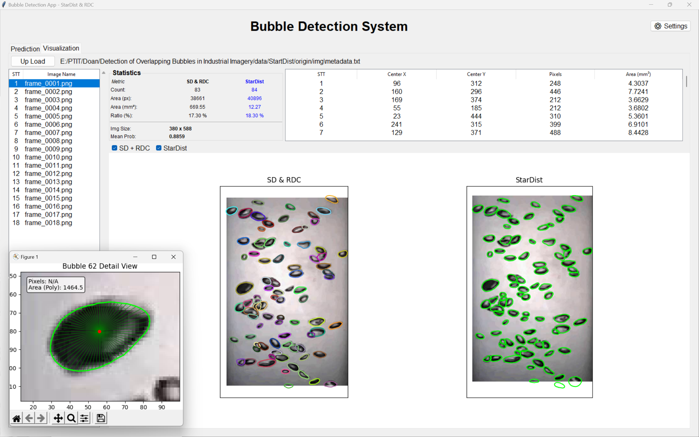

# Detection of Overlapping Bubbles in Industrial Imagery

This project focuses on the detection and segmentation of overlapping bubbles in industrial imagery. It implements a two-stage approach leveraging **StarDist** for instance segmentation and **Radial Distance Correction (RDC)** for accurate shape reconstruction of occluded bubbles.

The project consists of a research pipeline for model development and a desktop application for end-user deployment.

## Key Features

-   **Robust Detection:** Utilizes **StarDist** (Star-convex Object Detection) to effectively separate and detect densely overlapping bubbles.
-   **Shape Reconstruction:** Employs **Radial Distance Correction (RDC)** to predict and reconstruct the full shape of bubbles that are partially occluded by others.
-   **Desktop Application:** A user-friendly Graphical User Interface (GUI) built with Tkinter, allowing users to run the detection pipeline on images without interacting with code.
-   **Research Pipeline:** A complete set of Jupyter Notebooks for data preprocessing, synthetic data generation, and model training.

## System Previews

<p align="center">
  
</p>
<p align="center">
  <em>Figure 1: StarDist Prediction Result</em>
</p>

<p align="center">
  
</p>
<p align="center">
  <em>Figure 2: RDC Shape Reconstruction Visualization</em>
</p>

## Downloads

The trained models and datasets are available for download:

-   **Models:** [Download Link](https://drive.google.com/file/d/1zFzCtSpF-MMt-9Vn4YX1z6-FNZv7gdXz/view?usp=sharing) (Extract to `models/` directory)
-   **Data:** [Download Link](https://drive.google.com/file/d/1lacoqSXMYNLFrbuotgW9pmjNggzRTftk/view?usp=sharing) (Extract to `data/` directory)

For detailed instructions, see `models/README.md` and `data/README.md`.

## Project Structure

-   **`app/`**: Contains the source code for the Desktop Application.
    -   `main.py`: The entry point for launching the application.
-   **`research/`**: Jupyter notebooks and scripts for the experimental pipeline.
    -   `startdist-data-preprocess.ipynb`: Preprocessing raw images (Flatfield, DoG).
    -   `stardist-train-kaggle.ipynb`: Training the StarDist detection model.
    -   `rdc-data-gen.ipynb`: Generating synthetic training data for RDC.
    -   `rdc-train.ipynb`: Training the RDC shape reconstruction model.
    -   `prediction-demo.ipynb`: Interactive demo of the pipeline.
-   **`models/`**: Directory for storing trained model weights (StarDist and RDC).
-   **`data/`**: Directory for datasets (raw images, ground truth, synthetic data).

## Installation

1.  **Clone the repository:**
    ```bash
    git clone <your-repo-url>
    cd <repo-directory>
    ```

2.  **Install Dependencies:**
    It is recommended to use a virtual environment (Python 3.7+).
    ```bash
    pip install -r requirements.txt
    ```
    *Key dependencies include: `stardist`, `tensorflow`, `numpy`, `pandas`, `opencv-python`, `scikit-image`, `matplotlib`.*

## Usage

### 1. Desktop Application

The desktop application provides a visual interface for the bubble detection system.

**To run the app:**
```bash
python app/main.py
```
This will launch the window where you can load images, run detection, and view results.

### 2. Research & Development Pipeline

If you wish to retrain models or experiment with the algorithms, follow this notebook sequence in the `research/` directory:

1.  **Data Preprocessing**:
    Run `research/startdist-data-preprocess.ipynb` to prepare your raw images (applying Flatfield correction, Difference of Gaussians, etc.) for training.

2.  **Train StarDist Model**:
    Run `research/stardist-train-kaggle.ipynb` to train the detection backbone.

3.  **Generate RDC Data**:
    Run `research/rdc-data-gen.ipynb`. This notebook uses your ground truth data to generate synthetic overlapping scenarios, creating the training dataset for the shape correction model.

4.  **Train RDC Model**:
    Run `research/rdc-train.ipynb` to train the Neural Network that predicts full shapes from occluded segments.

5.  **Demo & Visualization**:
    Use `research/prediction-demo.ipynb` or `research/demo.py` to inspect the model's performance on test images visually.
